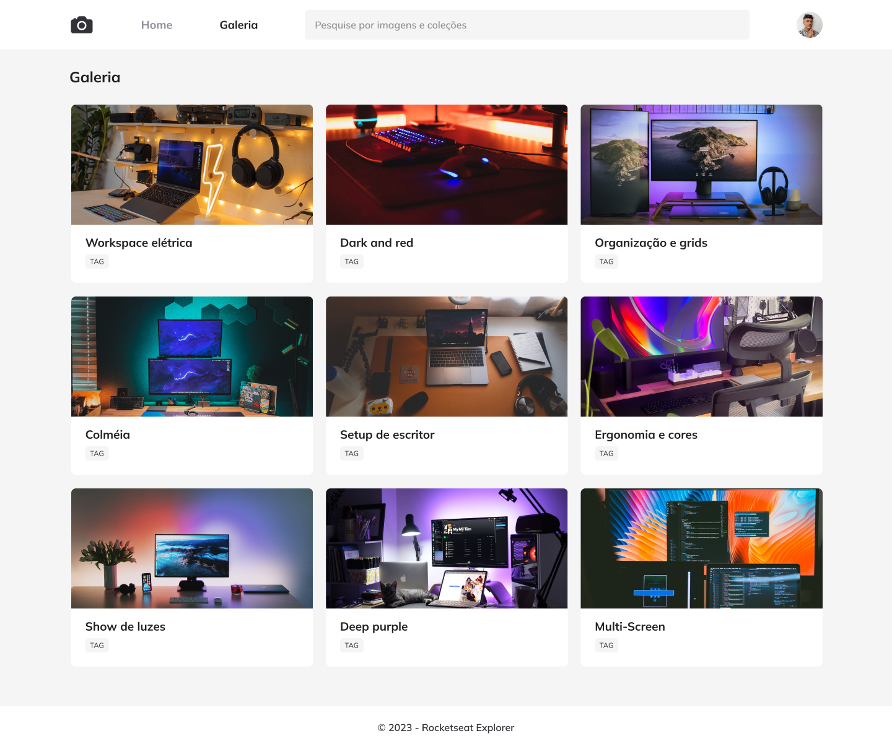

<h1 align="center">Fotoblog</h1>

Explorer | Stage 03 - Projeto Fotoblog

  <a href="#-tecnologias">Tecnologias</a>&nbsp;&nbsp;&nbsp;|&nbsp;&nbsp;&nbsp;
  <a href="#-projeto">Projeto</a>&nbsp;&nbsp;&nbsp;|&nbsp;&nbsp;&nbsp;
  <a href="#-licença">Licença</a>&nbsp;&nbsp;&nbsp;|&nbsp;&nbsp;&nbsp;
  <a href="#autor">Autor</a>

  

 

  

## 🚀 Tecnologias

Esse projeto foi desenvolvido com as seguintes tecnologias:

- HTML
- CSS
- JS

## 💻 Projeto

Este é um projeto aprendido durante o curso Explorer da [Rocketseat](https://www.rocketseat.com.br/).

O intuito deste projeto foi praticar alguns conceitos de HTML e CSS como:

- CSS Grid
- CSS Animation
- CSS Transition
- CSS Filter
- CSS Transform
- Variáveis CSS
- Tags HTML semânticas

Além do que foi aprendido durante as aulas, aproveitei para criar a funcionalidade de busca de fotos e também adicionei responsividade a página.

## 📝 Licença

Esse projeto está sob a licença MIT.

## Autor

 

Feito com 💜 por Jordane Chaves